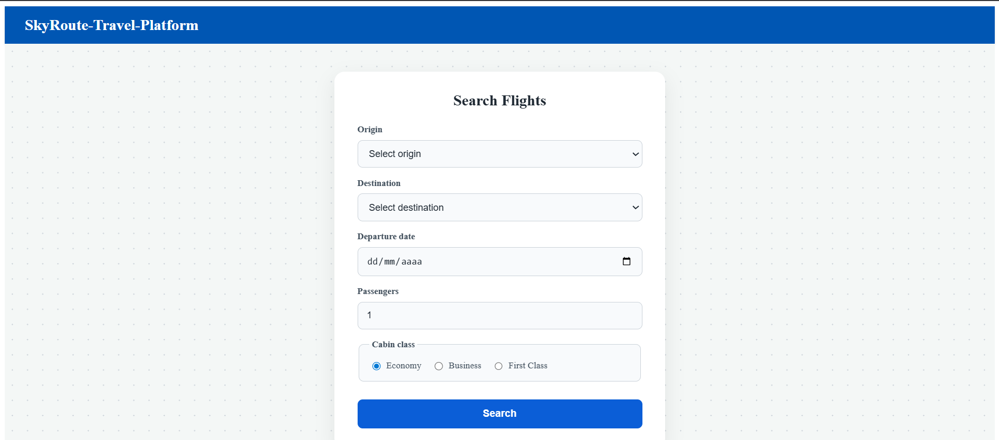
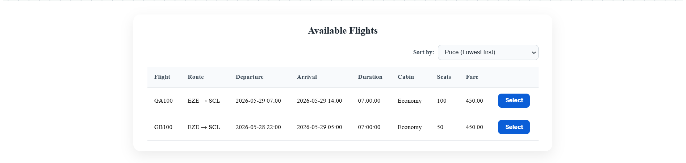
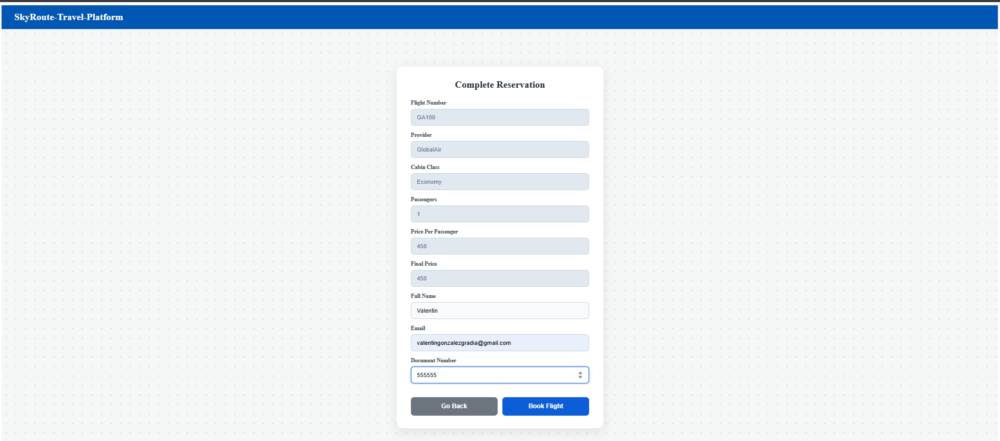
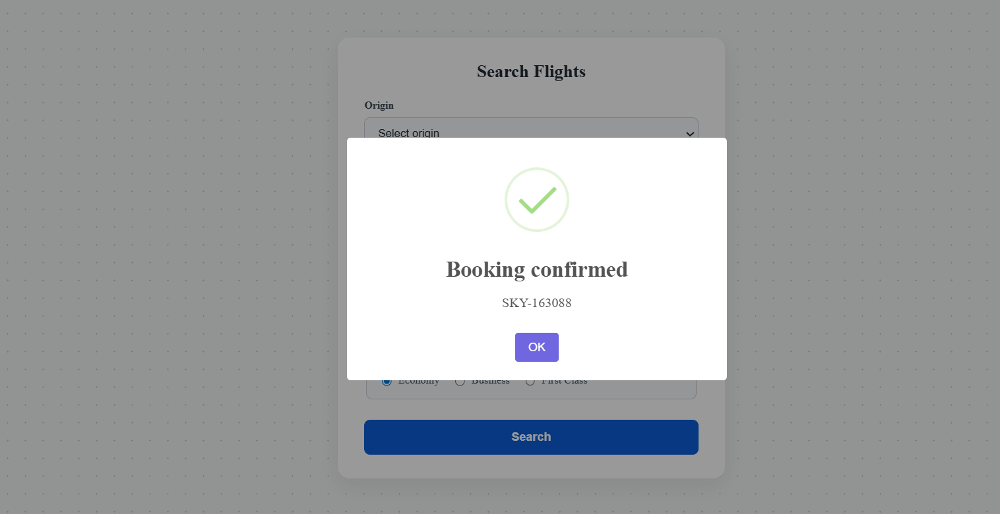

# Sky Route

SkyRoute — a travel aggregator platform that allows users to search, compare, and book flights. The business is growing fast and needs a well-architected, maintainable system that can evolve over time.

## Getting Started - Setup

### Run the Back-end
```bash
cd SkyRoute-Travel-Platform-BackEnd
dotnet restore
dotnet build
dotnet run
```

### Run the Front-end
```bash
cd SkyRoute-Travel-Platform-Frontend
npm install
npx ng serve
```

## Project Structure Overview
- **`SkyRoute-Travel-Platform-BackEnd/`**: .NET API containing domain models, design patterns implementations (Chain, Strategy in the providers), and data repositories.
- **`SkyRoute-Travel-Platform-Frontend/`**: Angular SPA with the search/booking interfaces and services to consume the backend API.

## Database

This project uses In-Memory data. Thus, the data is not stored throughout different execution instances. In Program.cs we define our in-memory database:
```bash 
builder.Services.AddDbContext<AppDbContext>(options =>
    options.UseInMemoryDatabase("SkyRouteDb")); 
```
## Endpoints
- POST api/bookings
	- Create a booking request

- GET api/bookings/<bookingReference>
	- Return one booking by booking reference

- GET api/flights/search
	- Return a List of FlightResponses through a SearchRequest

- GET api/flights/<flightNumber>
	- Return a flight by flight number


## Backend Architecture

- We are going to divide the Back-end logic into 3 layers. Layered Architecture

Controller → Service → Repository

Similar to a MVC but without a view layer due to the front-end is going to be developed apart from this logic.

- Models → Entities.
- Services → Business logic
- Controllers → HTTPs handlers.
- DB Context → Data access.
- Providers -> Just for searching and pricing

The scope of the project does not requiere a big architecture such as clean or hexagonal or onion architecture.  Simple and profesional.

### Software Patterns

Strategy : 
Used in the `Providers` folder to integrate multiple flight data sources (e.g., `GlobalAir`, `BudgetWinds`). Besides, the requirement says : "The platform expects to onboard additional airline providers in the future." Thus, every time a new arile is added, we create a new provider as an independent class to handle the specific provider logic.
- **Abstraction**: Core services interact with the `IFlightProvider` interface or `BaseFlightProvider`, keeping them agnostic of provider-specific details.
- **OCP/Extensibility**: You can seamlessly add new airline providers (with custom API logic or specialized pricing calculations) without modifying the main flight search logic.

Chain of Responsibility : 
Used to process pricing and seat availability based on the selected Cabin Class. Remember that flights contain all cabin classes, but we only have to return one.
- **Removes large conditionals**: Replaces giant `switch`/`if-else` blocks.
- **SRP & OCP**: Each handler manages only one specific cabin type. New cabins (e.g., Premium Economy) can be added without modifying existing code.
- **Decoupling**: The caller invokes the chain oblivious to which handler ultimately resolves the request.

### Business Rules

- **GlobalAir**: Base fare + 15% fuel surcharge. Always round the final price to 2 decimal places.
- **BudgetWings**: Base fare − 10% promotional discount. The minimum final price is $29.99. The discount is always applied to the base fare only.

## Frontend Architecture

The frontend implement a Component-Based Architecture through 3 layers.

- Component -> Display data, delegate logic to services and focus on the UI.
- Services -> Handle HTTP calls to the backend.
- Interfaces -> Define the shape of our data ensuring safety accros components and services when we retrieve data from the backend. 

### Routes 
/search          → Search form + Results below (same page)     
/booking         → BookingFormComponent

## Design

### Search Form


### Flights Results


### Booking Result


### Booking Confirmed



